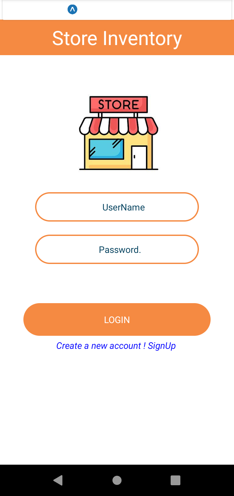
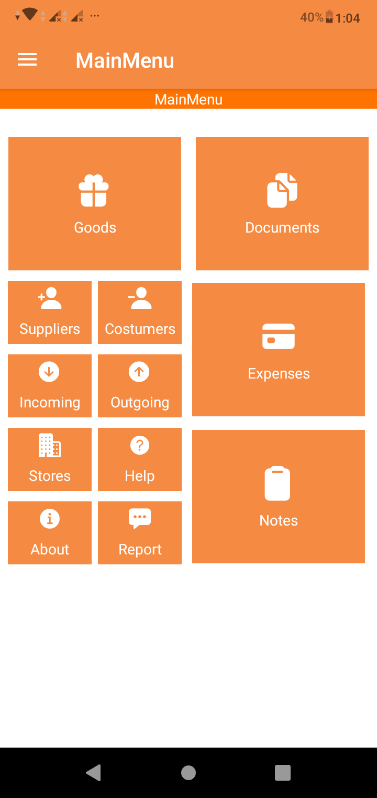

# Store-Inventory
Mobile App for Store Owners to manage their incoming and outgoing products ,  
save important documents of sales and goods and manage all their customers and suppliers contact and provide product price management

<table align='center'>
   <tr>
     <td>
        
     </td>
     <td >
       
     </td>
   </tr>
</table>

## 📚 Resources
- <a href="https://reactnative.dev/" >React Native </a>
- <a href="https://mongoosejs.com/docs/" > Mongoose </a>
